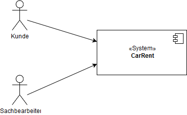
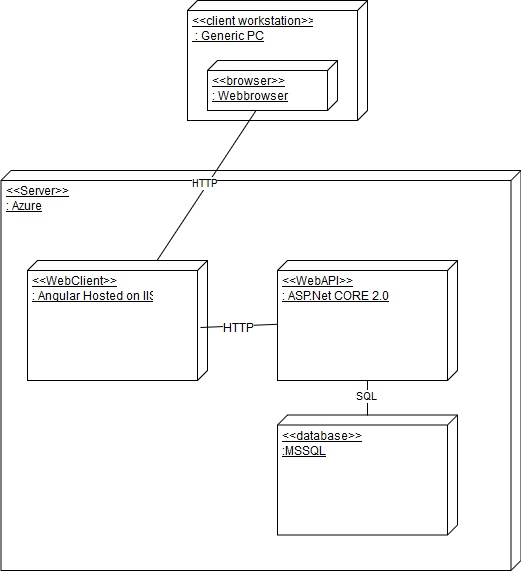
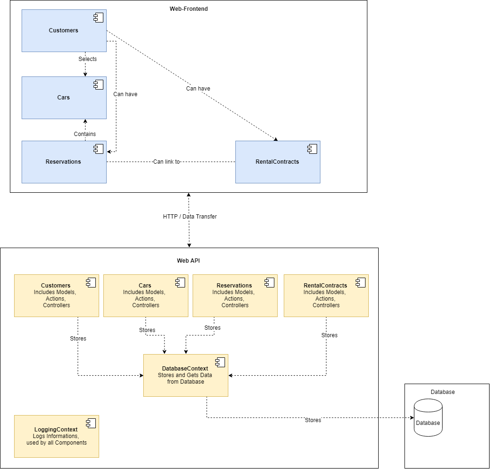
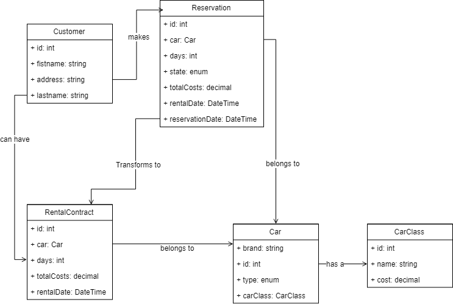

![alt text][logo]

[logo]: ./images/logo.png "Logo Title Text 2"

Autovermietung CarRent
======================

Diese Dokumentation wurde auf der Grundlage von arc 42 erstellt.

**Über arc42**

arc42, das Template zur Dokumentation von Software- und
Systemarchitekturen.

Erstellt von Dr. Gernot Starke, Dr. Peter Hruschka und Mitwirkenden.

Template Revision: 7.0 DE (asciidoc-based), January 2017

© We acknowledge that this document uses material from the arc 42
architecture template, <http://www.arc42.de>. Created by Dr. Peter
Hruschka & Dr. Gernot Starke.

Einführung und Ziele
====================

Aufgabenstellung
----------------
**Autovermietungssoftware CarRent**

CarRent ist die schnelle und einfache Art, ein Auto für den nächsten Trip zu reservieren. 
Die Reservierung soll einfach und unkompliziert sein.
CarRent Webclient soll für die Mitarbeiter von CarRent und deren Kunden eine intuitive Software sein um 
Autos zu reservieren und mieten.

Das Ziel ist eine Software, welche über Webclients gleichzeitig Fahrzeuge reserviert und verwaltet werden können.
 

Qualitätsziele
--------------
1. Performance: CarRent soll schnelle Antwortzeiten (<1 Sek.) und für parallele Anfragen in kleiner Anzahl ausgelegt sein.
2. Datenqualität: Keine Redundanzen, referentielle Integrität und Datenkonsistenz.
3. Usability: Die Benutzeroberfläche soll übersichtlich und intuitiv gestaltet sein.
4. Installierbarkeit: CarRent soll einfach eingerichtet werden können.
5. Erweiterbarkeit: CarRent soll für zukünftige Erweiterungen offen sein.

Stakeholder
-----------

| Rolle                | Kontakt             | Erwartungshaltung                              |
|----------------------|---------------------|------------------------------------------------|
| CEO CarRent          | Peter Müller        | Stabile und flexible Software, Kostenkontrolle |
| Kunden CarRent       |  K.Meier Vertretung | Schnelle Antwortzeiten, Intuitive Bedienung    |
| Mitarbeiter CarRent  |  M. Bär Vertretung  | Inutive Bedienung, Erweiterbarkeit             |
| Softwareentwickler   |  B. Schäublin       | Klare Anforderungen                            |

Randbedingungen
===============
<dl>
<dt> Developer Tools </dt>
<dd> VS2017 / R# … </dd>
<dd> Visual Studio Code / … </dd>
<dt>  Client Tier </dt>
<dd> Angular </dd>
<dd> Apache / Nginx </dd>
<dt>  Server Tier </dt>
<dd> ASP.NET Core </dd>
<dd> NLog </dd>
<dd> NHibernate if RDBMS </dd>
<dd> MongoDB if DocumentDB </dd>
<dt>  Testing </dt>
<dd> Z.B MSTest / Moq / FluentAssertion </dd>
<dt>  Data Tier (Choose) </dt>
<dd> SQL Server 2016 Express | Developer </dd>
<dd> MongoDB </dd>
<dt>  Build, Release und Metrik Tools </dt>
<dd> NuGet </dd>
<dd> Cake </dd>
<dd> Sonar </dd>
<dd> Proget </dd>
</dl>

Kontextabgrenzung
=================
CarRent ist ein egenständiges Reservierungssystem für Autos.  
Systemintern gibt es eine Schnittstelle zwischen GUI und BussinesAplication sowie zwischen BussinesAplication und Datenbank.  
CarRent hat keine Schnittstellen zu Fremdsystemen wie z.B. Zahlungssystemen oder Reparaturverwaltung für Autos.

Fachlicher Kontext
------------------

Kunden benutzen in einer ersten Phase das CarRent System nur über einen Sachbearbeiter. Der Sachbearbeiter führt alle interaktionen mit dem CarRent-System über das WebFrontend.  
In einer späteren Phase erhalten die Kunden ein eigenes Benutzerinterface. In diese können sie dann selbstständig Autos reservieren.

Technischer Kontext
-------------------

Über ein WebBrowser wird via HTTP auf den WebClient zugegriffen.  
Der WebClient macht seinerseitz Abragen über HTTP auf die WebAPI.
Diese speichert dann die Daten lokal auf der MSSQL Datenbank mit einem SQL-Protokoll.

Lösungsstrategie
================
Die folgende Tabelle stellt die Qualitätsziele von CarRent passenden Architekturansätzen gegenüber, und erleichtert so einen Einstieg in die Lösung.

| Qualitätsziel        | Dem Qualitätsziel zuträgliche Ansätze in der Architektur                                            |
|----------------------|---------------------------------------------------------------------------------------|
| Performance          | mit den HTTP Requests werden nur einzelne Daten abgefragt, keine komplexen Strukturen |        
| Datenqualität        | Die MSSQL Datenbank übernimmt die persistente Speicherung der Daten.                  |
| Usability            | Das WebFrontend wird mit Agular einach und übersichtlich gestaltet                    |
| Installierbarkeit    | Das WebFrontend benötigt keine Installation.                                          |
| Erweiterbarkeit      | Objektorientierte Programmierung und stabile Interfaces                               |

Bausteinsicht
=============

Whitebox Gesamtsystem
---------------------

Begründung

:   *&lt;Erläuternder Text&gt;*

Enthaltene Bausteine

:   *&lt;Beschreibung der enhaltenen Bausteine (Blackboxen)&gt;*

Wichtige Schnittstellen

:   *&lt;Beschreibung wichtiger Schnittstellen&gt;*

Laufzeitsicht
=============

Eine Laufzeitsicht ist im Moment nicht dokumentiert, da kein komplexer Ablauf gefordert ist.

Verteilungssicht
================

Infrastruktur Ebene
---------------------

Begründung

Die Vorgabe des Projekts war für die Infrastruktur entscheidend und musste wie folgt beschrieben umgesetzt werden:  
Das System soll aus einem Server-Teil und einem Web-Client bestehen. Die Daten sollen mittels OR-Mapper oder JDBC in eine relationale Datenbank gespeichert werden können. Die Business Logik soll auf einem Application Server laufen und einen RESTFul WebService Schnittstelle (WebAPI) anbieten. Der Web-Client benutzt die WebAPI um die Funktionen auszuführen.

Qualitäts- und/oder Leistungsmerkmale

:   *&lt;Erläuternder Text&gt;*

Konzepte
=========================

Entwurfsentscheidungen 
======================

Wir haben uns für MSSQL entschieden, da wir bereits Erfahrung mit MSSQL und Entity Framework haben.
Azure kam zum Zug, da ein automatisches Deployment einfach umzusetzen ist.
Weiter haben wir uns für Angular entschieden, da es ein aktueller Standard der Webentwicklung ist und wir ebenfalls erfahren darin sind.
SonarQube wurde zur Messung von Mektriken eingesetzt, da wir dies einmal ausprobieren wollten.

Qualitätsanforderungen
======================

Qualitätsbaum 
-------------

Qualitätsszenarien
------------------

Risiken und technische Schulden
===============================
 
Durch die kurze Entwicklungszeit sind nur begrenzt Tests geschrieben.
Für eine Erweiterung der Software sollte erst eine grosse Testabdeckung erreicht werden. 
Weiter sollte ein separates GUI für den Kunden entworfen werden, damit der Kunde nicht mehr über den Sachbearbeiter Autos reservieren kann.  
Der Logging-Kontext ist zur Zeit noch nicht umgesetzt.

Glossar
=======

| Begriff              | Definition                                   |
|----------------------|----------------------------------------------|
| *&lt;Begriff-1&gt;*  | *&lt;Definition-1&gt;*                       |
| *&lt;Begriff-2*      | *&lt;Definition-2&gt;*                       |

